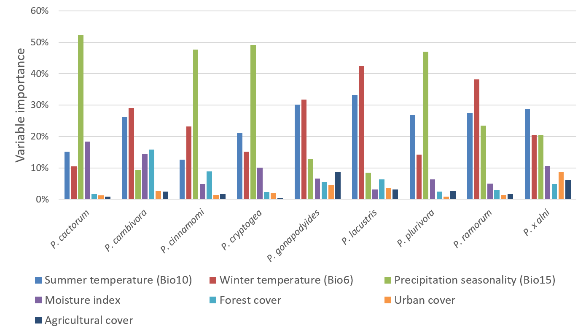

<style type="text/css">
.main-container {
  max-width: 1800px;
  margin-left: auto;
  margin-right: auto;
}
</style>

```{r setup, include=FALSE}
knitr::opts_chunk$set(echo = FALSE)

```
#Environmental risk factors for *Phytophthora* establishment

The environmental niches of pathogens can be estimated by matching patterns in their known occurrence with environmental risk factors. The maps presented below can be used to explore the predicted environmental suitability of 10km cells across the UK for a selection of *Phytophthora* species. The predictions are based on estimating how species global occurrences (excluding occurrences in the UK) are related to soil moisture, minimum Winter temperature, mean Summer temperature and land-use (agricultural, forest and urban cover). 
<br>


<br>  
<br>  
  
These relationships were then used to predict suitability across the UK for these species and to validate the predictions by comparing them to available records for each species. This was intended to provide proof-of-concept for whether these approaches could be used to predict the suitbility of the UK climate for *Phytophthora* pathogens that have not yet arrived in the UK. 


```{r niche_map, include=FALSE}
#library(biomod2)
library(raster)
library(leaflet)
library(rgdal)
library(leafem)

all_spp <- c("cambivora",
            "cinnamomi",
            "gonapodyides",
            "lacustris",
            "plurivora",
            "ramorum",
            "alni")

r <- lapply(grep("current\\.tif", list.files(pattern = paste(all_spp, collapse = "|"), recursive = TRUE), value = TRUE), raster)
extUK <- c(-450000, 130000, 5800000, 6900000)
r <- lapply(1:length(r), function(i) projectRaster(from = crop(r[[i]], extUK), crs = crs("+proj=longlat +ellps=WGS84 +datum=WGS84 +no_defs +towgs84=0,0,0"), method = "bilinear"))


load("data/UK_anon10kpoly.rData")

```

```{r fig.width = 10, error=FALSE, warning=FALSE}


# leafletem not working so I can't add mouseover for suitability values
pal <- colorNumeric(c("blue", "white", "red"), values(stack(r)),   na.color = "transparent")
# UK_points$nursery_widerEnvironment <- factor(UK_points$nursery_widerEnvironment)
# pal <- colorFactor(c("navy", "red"), domain = c("nursery", "wider environment"))

 leaflet(UK_anon10kpoly, width = "100%") %>% 
   addProviderTiles("OpenTopoMap", group = "OpenTopoMap") %>% #, options = providerTileOptions(minZoom=5, maxZoom=10)) %>%
   addPolygons(data = UK_anon10kpoly[[1]], 
               color = "black", 
               fill = TRUE,
               fillColor = "transparent",
               group = paste0("P. ", all_spp[1]),
              # layerId = paste0("P. ", all_spp[1]),
               label = ~host,
              highlight = highlightOptions(
                weight = 1.5,
                color = "black",
                bringToFront = TRUE)
              ) %>% 
   addPolygons(data = UK_anon10kpoly[[2]], 
               color = "black", 
               fill = TRUE,
               fillColor = "transparent",
               group = paste0("P. ", all_spp[2]),
              # layerId = paste0("P. ", all_spp[2]),
               label = ~host,
              highlight = highlightOptions(
                weight = 1.5,
                color = "black",
                bringToFront = TRUE)) %>% 
   addPolygons(data = UK_anon10kpoly[[3]], 
               color = "black", 
               fill = TRUE,
               fillColor = "transparent",
               group = paste0("P. ", all_spp[3]),
               #layerId = paste0("P. ", all_spp[3]),
               label = ~host,
              highlight = highlightOptions(
                weight = 1.5,
                color = "black",
                bringToFront = TRUE)) %>% 
   addPolygons(data = UK_anon10kpoly[[4]], 
               color = "black", 
              fill = TRUE,
               fillColor = "transparent",
               group = paste0("P. ", all_spp[4]),
               #layerId = paste0("P. ", all_spp[4]),
               label = ~host,
              highlight = highlightOptions(
                weight = 1.5,
                color = "black",
                bringToFront = TRUE)) %>% 
   addPolygons(data = UK_anon10kpoly[[5]], 
               color = "black", 
               fill = TRUE,
               fillColor = "transparent",
               group = paste0("P. ", all_spp[5]),
               #layerId = paste0("P. ", all_spp[5]),
               label = ~host) %>% 
   addPolygons(data = UK_anon10kpoly[[6]], 
               color = "black", 
               fill = TRUE,
               fillColor = "transparent",
               group = paste0("P. ", all_spp[6]),
               #layerId = paste0("P. ", all_spp[6]),
               label = ~host,
              highlight = highlightOptions(
                weight = 1.5,
                color = "black",
                bringToFront = TRUE)) %>% 
   addPolygons(data = UK_anon10kpoly[[7]], 
               color = "black", 
               fill = TRUE,
               fillColor = "transparent",
               group = paste0("P. ", all_spp[7]),
               #layerId = paste0("P. ", all_spp[7]),
               label = ~host,
              highlight = highlightOptions(
                weight = 1.5,
                color = "black",
                bringToFront = TRUE)) %>% 
   # addCircleMarkers(data = UK_validation[grep(all_spp[1], UK_validation$species),],
   #                  radius = 20,
   #                  stroke = FALSE, 
   #                  fillOpacity = 0.5,
   #                  label = ~host,
   #                  color = "black", 
   #                  group = paste0("P. ", all_spp[1])) %>%
   # addCircleMarkers(data = UK_validation[grep(all_spp[2], UK_validation$species),],
   #                  radius = 4,
   #                  stroke = FALSE, 
   #                  fillOpacity = 0.5,
   #                  label = ~host,
   #                  color = "black", 
   #                  group = paste0("P. ", all_spp[2])) %>%
   # addCircleMarkers(data = UK_validation[grep(all_spp[3], UK_validation$species),],
   #                  radius = 4,
   #                  stroke = FALSE, 
   #                  fillOpacity = 0.5,
   #                  label = ~host,
   #                  color = "black", 
   #                  group = paste0("P. ", all_spp[3])) %>%
   # addCircleMarkers(data = UK_validation[grep(all_spp[4], UK_validation$species),],
   #                  radius = 4,
   #                  stroke = FALSE, 
   #                  fillOpacity = 0.5,
   #                  label = ~host,
   #                  color = "black", 
   #                  group = paste0("P. ", all_spp[4])) %>%
   # addCircleMarkers(data = UK_validation[grep(all_spp[5], UK_validation$species),],
   #                  radius = 4,
   #                  stroke = FALSE, 
   #                  fillOpacity = 0.5,
   #                  label = ~host,
   #                  color = "black", 
   #                  group = paste0("P. ", all_spp[5])) %>%
   # addCircleMarkers(data = UK_validation[grep(all_spp[6], UK_validation$species),],
   #                  radius = 4,
   #                  stroke = FALSE, 
   #                  fillOpacity = 0.5,
   #                  label = ~host,
   #                  color = "black", 
   #                  group = paste0("P. ", all_spp[6])) %>%
   # addCircleMarkers(data = UK_validation[grep(all_spp[7], UK_validation$species),],
   #                  radius = 4,
   #                  stroke = FALSE, 
   #                  fillOpacity = 0.5,
   #                  label = ~host,
   #                  color = "black", 
   #                  group = paste0("P. ", all_spp[7])) %>%
   addRasterImage(r[[1]], colors = pal, opacity = 0.8, group = paste0("P. ", all_spp[1]), layerId = paste0("P. ", all_spp[1])) %>% 
   addRasterImage(r[[2]], colors = pal, opacity = 0.8, group = paste0("P. ", all_spp[2]), layerId = paste0("P. ", all_spp[2])) %>% 
   addRasterImage(r[[3]], colors = pal, opacity = 0.8, group = paste0("P. ", all_spp[3]), layerId = paste0("P. ", all_spp[3])) %>% 
   addRasterImage(r[[4]], colors = pal, opacity = 0.8, group = paste0("P. ", all_spp[4]), layerId = paste0("P. ", all_spp[4])) %>% 
   addRasterImage(r[[5]], colors = pal, opacity = 0.8, group = paste0("P. ", all_spp[5]), layerId = paste0("P. ", all_spp[5])) %>% 
   addRasterImage(r[[6]], colors = pal, opacity = 0.8, group = paste0("P. ", all_spp[6]), layerId = paste0("P. ", all_spp[6])) %>% 
   addRasterImage(r[[7]], colors = pal, opacity = 0.8, group = paste0("P. ", all_spp[7]), layerId = paste0("P. ", all_spp[7])) %>% 
   addLegend(pal = pal, values = values(r[[1]]),
              title = "predicted suitability") %>%
  addLegend(data = UK_anon10kpoly,
            colors = "black",
            labels = "known records",
            opacity = 0.1,
            title = "",
            position = "bottomleft") %>%
   addLayersControl(baseGroups = c(paste0("P. ", all_spp)),
                    options = layersControlOptions(collapsed = FALSE)) %>% 
   #hideGroup("OpenTopoMap") %>%
   leafem::addMouseCoordinates() %>% 
   addHomeButton(extent(UK_anon10kpoly[[1]]), layer.name = "Back to UK")  %>%
   leafem::addImageQuery(r[[1]], type="mousemove", layerId = paste0("P. ", all_spp[1]), group = paste0("P. ", all_spp[1]) , digits = 3, prefix = "suitability", position = "topleft") %>%
   leafem::addImageQuery(r[[2]], type="mousemove", layerId = paste0("P. ", all_spp[2]), group = paste0("P. ", all_spp[2]) , digits = 3, prefix = "suitability", position = "topleft") %>%
   leafem::addImageQuery(r[[3]], type="mousemove", layerId = paste0("P. ", all_spp[3]), group = paste0("P. ", all_spp[3]) , digits = 3, prefix = "suitability", position = "topleft") %>%
   leafem::addImageQuery(r[[4]], type="mousemove", layerId = paste0("P. ", all_spp[4]), group = paste0("P. ", all_spp[4]) , digits = 3, prefix = "suitability", position = "topleft") %>%
   leafem::addImageQuery(r[[5]], type="mousemove", layerId = paste0("P. ", all_spp[5]), group = paste0("P. ", all_spp[5]) , digits = 3, prefix = "suitability", position = "topleft") %>%
   leafem::addImageQuery(r[[6]], type="mousemove", layerId = paste0("P. ", all_spp[6]), group = paste0("P. ", all_spp[6]) , digits = 3, prefix = "suitability", position = "topleft")  %>%
   leafem::addImageQuery(r[[7]], type="mousemove", layerId = paste0("P. ", all_spp[7]), group = paste0("P. ", all_spp[7]) , digits = 3, prefix = "suitability", position = "topleft")
 


```
##Data sources
Information on *Phytophthora* outbreaks in the wider environment within the UK were provided by the Animal and Plant Health Agency, Science and Advice for Scottish Agriculture, the Royal Horticultural Society, Forest Research, Forestry Commission Scotland and Natural Resources Wales. They have been coarsened to 10km resolution to avoid identification of specific premises. No data from nurseries is presented.  

Global *Phytophthora* distribution data were compiled from the literature and include contributed data from more than 100 expert pathologists.


## [Enter my feedback - UK suitability models](<https://forms.gle/S7scwuArUAtXU2AD9>)


